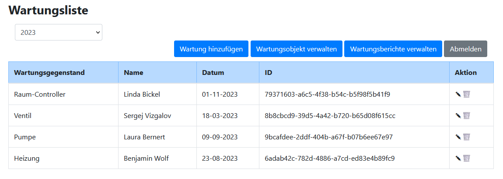
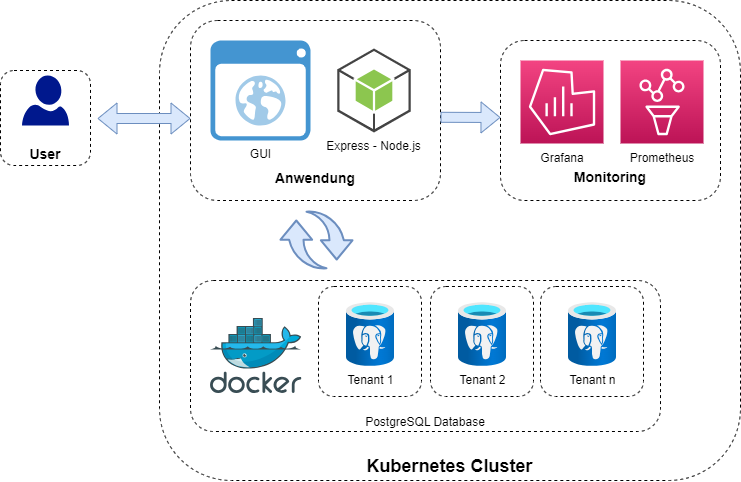
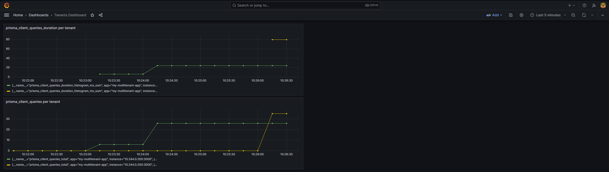
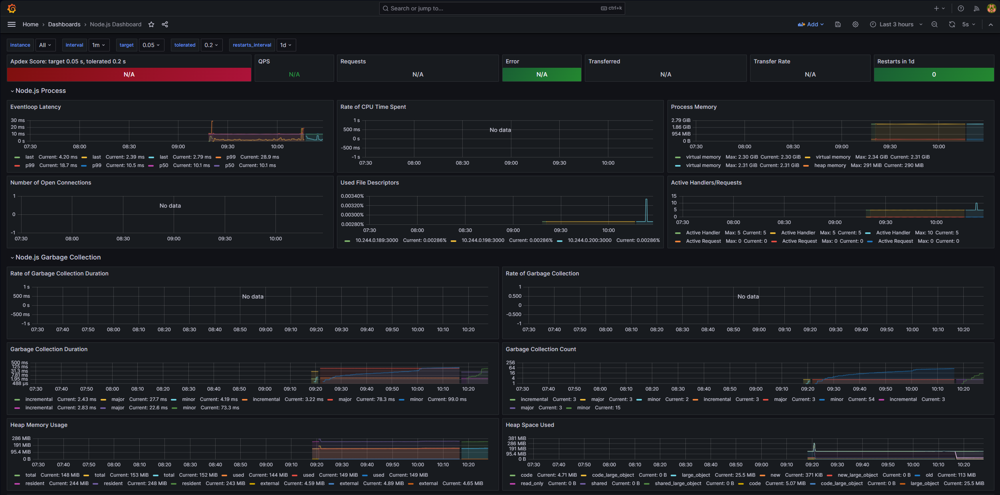

# 1. Dokumentation der Anwendung (Teil von Herrn Pfisterer)

## 1.1 Get Started

Folgende Kommandozeilenbefehle müssen ausgeführt werden:

```
minikube start --cpus=4 --memory=4000 --addons=ingress --mount-string="/run/udev:/run/udev" --mount
```

```
helm repo add openebs https://openebs.github.io/charts
helm repo update
helm install openebs --namespace openebs openebs/openebs --create-namespace
```

```
kubectl apply -f https://raw.githubusercontent.com/reactive-tech/kubegres/v1.16/kubegres.yaml
```

```
skaffold dev
```

```
minikube tunnel (in neuem Terminal)
```

Die Anwendung kann dann unter "localhost" im Browser aufgerufen werden.

Zur Anmeldung in der Anwendung können folgende Anmeldeinformationen genutzt werden:

Für Tenant 1
- Benutzername: user1
- Passwort: password1

Für Tenant 2
- Benutzername: user2
- Passwort: password2

## 1.2 Zielsetzung

Es soll eine Multi-Tenancy-Anwendung bereitgestellt werden, um Wartungen an Systemen und Geräten zu dokumentieren. Kunden der Anwendungen könnten jegliche Unternehmen sein, welche Wartungen durchführen müssen. Die Idee der Anwendung stammt aus der Branche der Gebäudeautomatisierung, da hier besonders häufig Wartungen vorgenommen und standardisiert (z.B. nach AMEV) dokumentiert werden müssen.

Um die Zielsetzung noch etwas zu schärfen, wird der Begriff Multi-Tenancy etwas näher betrachtet. Multi-Tenancy ist der englische Begriff für Mandantenfähigkeit. Mandantenfähigkeit ist die Eigenschaft eines Systems, die es verschiedenen Kunden (Mandanten) ermöglicht, die Ressourcen eines Systems transparent gemeinsam zu nutzen und dabei das System nach ihren individuellen Bedürfnissen zu konfigurieren. Tenant ist dabei der englische Begriff für Mandant und definiert eine Gruppe von Nutzern, die eine gemeinsame Sicht auf die Daten haben. Für unsere Anwendung würde ein Tenant einem Unternehmen entsprechen, welches Wartungen von Systemen und Geräten dokumentiert. Eine Multi-Tenancy-Anwendung sollte folgende Eigenschaften erfüllen: Anpassbarkeit, Wartbarkeit, Ressourcenteilung, Performance-Isolation, Skalierbarkeit, Fehlertoleranz und Sicherheit. Unser Ziel ist es, ganz besonders den Aspekt der Skalierbarkeit zu berücksichtigen und somit eine möglichst skalierbare Anwendung zur Verfügung zu stellen.

## 1.3 Funktionalität

Nach der Anmeldung zeigt die Multi-Tenancy-Anwendung alle durchgeführten Wartungen an Geräten oder Systemen. Die Wartungen gehören dabei Berichten an, die jeweils durch ihre Jahreszahl identifiziert werden. Ein solch beispielhafter Wartungsbericht für das Jahr 2023 ist im nachfolgenden Bild zu finden.



Unserer Anwendung zur Dokumentation von Wartungen hat drei wesentliche Funktionen:
- Wartungsobjekte verwalten: Diese Funktion ermöglicht es, Systeme und Geräte als Wartungsobjekt anzulegen oder bereits bestehende Wartungsobjekte zu löschen.
- Wartungsberichte verwalten: Mithilfe dieser Funktion kann ein neuer Wartungsbericht für ein Jahr angelegt oder bestehende Wartungsberichte vollständig gelöscht werden.
- Wartungen hinzufügen: Es können neue Wartungen mit Name des Durchführenden und Datum angelegt werden. Zudem können bestehende Wartungen über die Spalte "Aktion" bearbeitet oder gelöscht werden.

## 1.4 Bestandteile 

- GUI mit Bootstrap: Die grafische Benutzeroberfläche dient dazu, dem Benutzer die Interaktion mit der Anwendung zu ermöglichen. Mithilfe der GUI kann der Benutzer Wartungsobjekte und Berichte verwalten sowie Wartungen hinzufügen. Für die Benutzeroberfläche wird das Framework Bootstrap genutzt.

- Express: Für die Webanwendung wird Express verwendet. Dabei handelt es sich um ein Framework für Node.js, um Server zu erstellen und Routen zu definieren.

- Datenbanken: Neben der grafischen Benutzeroberfläche gibt es mehrere Datenbanken. Die Datenbanken besitzen jeweils die folgenden drei Tabellen: Maintenance Object, Maintenance Report und Maintenance Report Entry. Es wird PostgreSQL als relationales Datenbankmanagementsystem genutzt.

- JSON Web Tokens: Zur Authentifizierung der Benutzer und zur Übermittlung von Autorisierungsinformationen werden JSON Web Tokens verwendet. Es handelt sich um eine kompakte und sichere Möglichkeit, um Informationen zwischen zwei Parteien auszutauschen.

## 1.5 Architektur



- Docker: Die Containerisierungsplattform Docker wird genutzt, um die Datenbanken innerhalb eines Containers zu starten. Auch die GUI und die Monitoringsysteme werden jeweils in einem gesonderten Container gestartet.

- Kubernetes: Das Orchestrierungstool wird genutzt, um die verschiedenen Container zu verwalten.

- Skaffold: Mit diesem Tool wir der Build- und Bereitstellungsprozess der Container automatisiert.

- Prometheus & Grafana: Das Monitoring- und Alarmierungssystem Prometheus wird genutzt, um die Containerumgebung zu überwachen. Hierzu verfügt die Anwendung über eine Prometheus-Schnittstelle, welche pro Tenant Monitoringdaten zur Verfügung stellt. Grafana kann gut mit Prometheus integriert werden und wird daher zur Visualisierung genutzt. Die nachfolgenden zwei Bilder zeigen zwei beispielhafte Monitoring-Dashboards unserer Anwendung. Das erste Dashboard wurde selbst erstellt, während das zweite Dashboard von folgender Quelle bezogen wurde: https://grafana.com/grafana/dashboards/12230-node-js-dashboard/.





## 1.6 Herausforderungen und Fazit

Wie aus dem Architektur-Schaubild hervorgeht, gibt es in unserer Anwendung pro Tenant eine Datenbank. Unser Ziel war es, eine möglichst skalierbare Anwendung zur Verfügung zu stellen, weshalb die Bereitstellung der skalierbaren Postgres eine Herausforderung darstellte. In jeder bereitgestellten Ressource in Kubernetes müssen dieselben Daten zu jedem Zeitpunkt verfügbar sein. Um dies zu ermöglichen, arbeiten wir mit dem Postgres-Operator "Kubegres" (https://www.kubegres.io/doc/getting-started.html). Dafür wird ein Kubernetes-Objekt vom Typ Kubegres konfiguriert, welches mit einem Secret und einer ConfigMap arbeitet. Diese Ressourcen haben wir ebenfalls konfiguriert.

Mit diesem Lösungsansatz ist es uns gelungen, eine konsistente und persistente Postgres über mehrere Replikationen hinweg zur Verfügung zu stellen. Neben den Datenbanken sind auch die Frontend-Server beliebig skalierbar. Somit konnten wir unser Ziel einer möglichst skalierbaren Multi-Tenancy-Anwendung zur Dokumentation von Wartungen verwirklichen.

# 2. Diskussion der Cloud Native Anwendung (Teil von Herrn Sturm)

## 2.1 Grundlagen Cloud Native Anwendung

Eine Cloud Native Anwendung zeichnet sich durch fünf wesentliche architektonische Prinzipien aus:
- Microservices: Es werden kleine, lose gekoppelte Services entwickelt. Die Services kommunizieren mithilfe von Schnittstellen miteinander.
- Dynamic Management: Cloud Ressourcen können dynamisch erweitert und reduziert werden.
- Containerisierung: Das ist der Prozess des Bündelns einer Anwendung zusammen mit ihrer gesamten Laufzeitumgebung, einschließlich der Abhängigkeiten und Ressourcen, in einen einzigen ausführbaren Container.
- Orchestrierung: Das Container Management erfolgt mithilfe von Software.
- Automation: Aufgaben wie Deployment oder Testing werden automatisiert.

All diese Prinzipien werden von unserer App erfüllt, weshalb es sich um eine Cloud Native Anwendung handelt.

## 2.2 Vorteile aus Realisierung als Cloud Native

- Skalierbarkeit und Ressourcennutzung: Unsere Anwendung kann flexibel auf wachsende Lasten reagieren. Sie kann durch das Hinzufügen von Datenbank-Instanzen sowie Servern für das Backend und das Frontend horizontal skaliert werden. Auf diese Weise ist eine effiziente Nutzung der Ressourcen möglich.

- Isolation und Portabilität: Die Container garantieren, dass unsere Anwendung in der gleichen Umgebung ausgeführt wird, in der sie entwickelt und getestet wurde. Dadurch werden Probleme vermieden, die durch Unterschiede zwischen Entwicklungs-, Test- und Produktionsumgebungen verursacht werden könnten. Zudem ist die Portabilität gegeben. Das bedeutet, dass die Container problemlos zwischen verschiedenen Infrastrukturen verschoben werden können. Das schnelle Starten von Containern ermöglicht eine agile Bereitstellung der Anwendung. Die Verwaltung und Orchestrierung der Container ist mithilfe von Kubernetes einfach möglich.

- Automatisierung: Die Cloud Native Anwendung ermöglicht eine automatisierte Bereitstellung, Wartung und Verwaltung. Durch Continuous Integration (CI) und Continuous Deployment (CD) Prozesse können Updates und Releases schnell und zuverlässig durchgeführt werden.

- Erreichbarkeit über Internet: Die Anwendung kann über das Internet einfach zugänglich gemacht werden. Durch den Einsatz von Load-Balancing und Reverse-Proxies können Anfragen effizient verteilt und die Verfügbarkeit der Anwendung verbessert werden.

- Monitoring: Die Monitoring-Tools Prometheus und Grafana ermöglichen, die Überwachung von Protokollen, Metriken und der Performance. Das führt dazu, dass Probleme frühzeitig erkannt und schnell behoben werden können.

- Resilienz und Ausfallsicherheit: Cloud Native Anwendungen sind darauf ausgelegt, Ausfälle zu minimieren und sich schnell zu erholen. Durch die Verwendung von Redundanz in Form von Datenbank-Replikationen sowie Replikationen der Backend- und Frontend-Server ist unsere Anwendung besonders widerstandsfähig gegenüber Störungen. Zusätzlich könnte bei Bedarf eine automatische Skalierung und Fehlertoleranzmechanismen genutzt werden.

## 2.3 Nachteile aus Realisierung als Cloud Native

- Komplexität der Architektur: Unsere Cloud Native Anwendung weist aufgrund der Verwendung von Docker und Kubernetes eine erhöhte Komplexität der Architektur auf.

- Tests und Debugging: Die Test- und Debugging-Prozesse können komplizierter werden, da Cloud Native Anwendungen aus mehreren unabhängigen Komponenten bestehen. Es kann schwieriger sein, die Interaktionen zwischen den einzelnen Komponenten zu verstehen.

- Abhängigkeit von Netzwerk: Cloud Native Anwendungen sind stark von der Zuverlässigkeit des Netzwerks abhängig. Eine schlechte Netzwerkverbindung oder Netzwerkprobleme können die Leistung und Verfügbarkeit der Anwendung beeinträchtigen.

- Kosten: Obwohl Cloud Native Ansätze eine effiziente Ressourcennutzung ermöglichen, kann es dennoch zu Kostensteigerungen kommen, wenn Ressourcen nicht richtig verwaltet werden. Es ist wichtig, die Kosten im Auge zu behalten und geeignete Kontrollmechanismen zu implementieren.

- Vendor Lock-In: Bei der Nutzung von Cloud-Plattformen und spezifischen Diensten besteht die Gefahr des Vendor Lock-Ins. Das bedeutet, dass es schwierig sein kann, zu einer anderen Cloud-Plattform zu wechseln, wenn die Anwendung stark an die spezifischen Dienste des aktuellen Anbieters gebunden ist.

## 2.4 Alternative Realisierungsmöglichkeiten mit kritischer Erörterung

Es wäre auch denkbar, die Anwendung mit einem Backend- und einem Frontend-Server monolithisch zu bauen und keine Container zu nutzen. Auf diese Weise wäre die Architektur deutlich einfacher gewesen. Das Problem wäre allerdings gewesen, dass die Anwendung nicht skalierbar wäre. Falls die Anwendung irgendwann von einer Vielzahl an Kunden genutzt wird und die Server Lastspitzen erreichen, ist eine Erweiterung der Ressourcen nicht einfach möglich. Das könnte dazu führen, dass Kunden abspringen und es zu Geldeinbußen aufgrund der fehlenden Skalierbarkeit kommt. Zudem könnte es bei einer fehlenden Containerisierung zu Portabilitätsproblemen kommen. Auch die Wartung und das Einspielen von Updates ist deutlich erschwert.

Alternativ ist eine Realisierung als On-Premise-Lösung denkbar, um den Kunden die Möglichkeit zu bieten, die Anwendung im eigenen Rechenzentrum zu betreiben. Dies erlaubt den Kunden die Hoheit über die eigenen Daten zu behalten, erfordert jedoch erhebliche Investitionen in Hardware und Wartung. 

## 2.5 Gewährleistung des Datenschutzes und der Datensicherheit

Häufig werden in Cloud Native Anwendungen personenbezogene Daten gesammelt und verwendet, die bei einem Cloud-Anbieter im Rechenzentrum abliegen. Der Cloud-Anbieter hat somit physischen Zugriff auf die Server, auf denen die Daten gespeichert sind. Dies kann Bedenken hinsichtlich der Kontrolle über die Daten und der möglichen Offenlegung vertraulicher Informationen aufwerfen.

Es ist wichtig zu verstehen, wie der Cloud-Anbieter mit den gespeicherten Daten umgeht. Unterschiedliche Länder und Regionen haben unterschiedliche Datenschutzgesetze und -vorschriften. Es ist wichtig sicherzustellen, dass der Cloud-Anbieter die erforderlichen rechtlichen Anforderungen erfüllt, insbesondere wenn es um die Speicherung und Verarbeitung sensibler Daten geht.

In unserer Anwendung werden als personenbezogene Daten nur der Name der Person, welche die Wartung durchgeführt hat, verwaltet. Hierfür ist die DSGVO relevant. Allerdings ist im Fall der Anwendung zur Dokumentation von Wartungen der Datenschutz und die Datensicherheit nicht als besonders kritisch zu betrachten. Grund hierfür ist, dass im Falle eines Systemausfalls keine Personenschäden, finanzielle Verluste oder Eigentumsgefährdungen zu befürchten sind. Der Geschäftsprozess ist zwar beeinträchtigt, kann aber zu einem späteren Zeitpunkt abgeschlossen werden. Das Gefährdungspotential ist deshalb als niedrig einzustufen. 
Interessant wird es nur, wenn Unternehmen die Anwendung nutzen möchten, welche streng geheime Systeme und Geräte verwalten. Für diese Unternehmen ist die Cloud Native Anwendung ungeeignet.

Für den Produktiveinsatz ist Sorge zu tragen, dass das System die IT-Sicherheitsziele vollständig erfüllt. Insbesondere die Vertraulichkeit, die Integrität sowie die Verfügbarkeit der Daten muss gewährleistet sein. Die Daten müssen ebenfalls beim Übertragen verschlüsselt werden. Für diesen Zweck kann beispielsweise auf die OpenSSL-Bibliothek zurückgegriffen werden. 
Darüber hinaus ist ein geeignetes Identity und Access Management zu implementieren, welches nur berechtigten Personen den Zugriff auf die Daten ermöglicht.

## 2.6 Fazit

Die Implementierung der Anwendung als Cloud Native Anwendung hat zahlreiche Vorteile mit sich gebracht. Besonders sind an dieser Stelle die Skalierbarkeit, die Automatisierung und das Monitoring hervorzuheben. Als größter Nachteil ist der Datenschutz und die Datensicherheit zu nennen. Allerdings ist dies für unsere Anwendung nicht als hochkritisch zu betrachten. Zusammenfassend kann somit gesagt werden, dass die Implementierung als Cloud Native Anwendung in unserem Fall sinnvoll war, dies jedoch immer je Anwendungsfall separat geprüft werden muss.

# 3. Autoren
- Laura Bernert (7686060)
- Linda Bickel (2929482)
- Sergej Bryan Vizgalov (6961809)
- Benjamin Wolf (4354642)